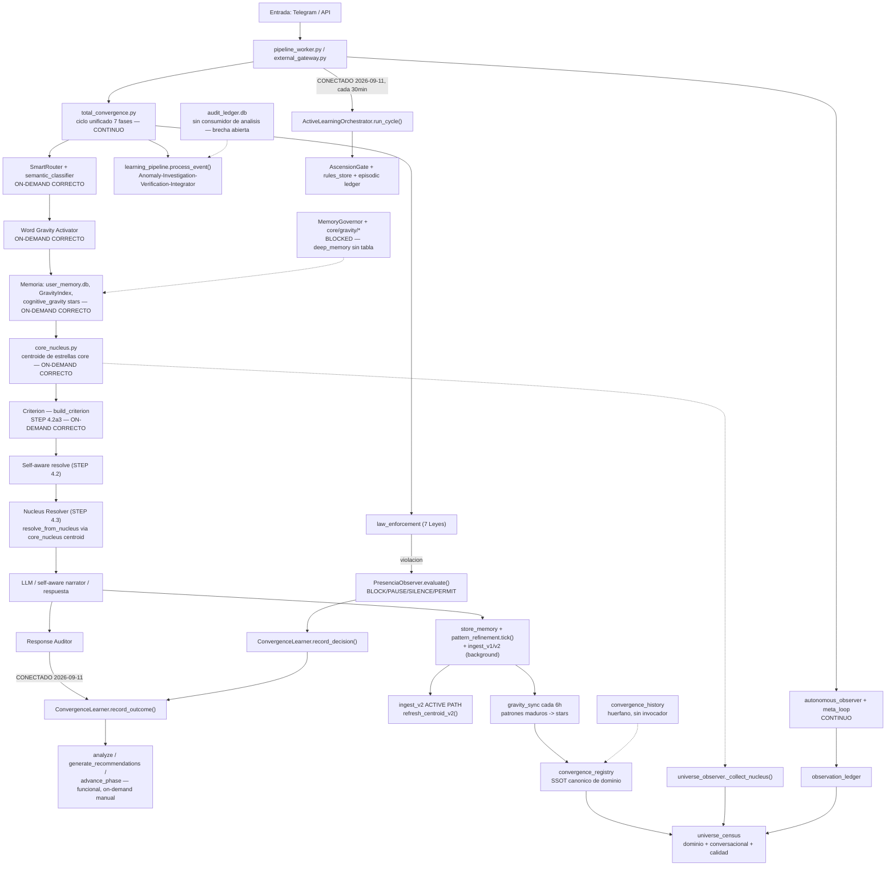

# VECTRAX — Auditoría del Circuito Funcional de Extremo a Extremo (2026-09-11)

Informe final archivado. Cubre el trazado completo del circuito `observación → análisis → patrones → convergencias → ejecución → resultado → observación`, las correcciones aplicadas con evidencia real, y las brechas que quedan explícitamente abiertas para trabajo futuro.

**Ver también**: `docs/ENGINES.md` (catálogo vivo de motores, sincronizado con los hallazgos de esta auditoría).

## Metodología

Investigación con evidencia real contra producción (no lectura de docstrings ni asunciones) → plan mínimo reutilizando arquitectura existente → implementación → prueba real (nunca mocks) → regresión → commit → push → despliegue → verificación post-reinicio. Ningún defecto se corrigió fabricando datos o inventando componentes nuevos; donde la evidencia no alcanzaba para una conexión limpia, se reportó como bloqueo explícito en vez de decidir unilateralmente.

## Sistema de clasificación

- **CONTINUO** — corre en loop de fondo real, confirmado con PID/logs vivos.
- **ON-DEMAND CORRECTO** — se activa correctamente cuando su condición de diseño se cumple; no tener loop propio no es un defecto si esa es la intención.
- **DEFECTO REAL / huérfano** — pasa health-check o se registra, pero nunca se activa después, ni en loop ni bajo demanda, aunque su diseño lo esperaba.
- **BLOCKED** — evidencia real contradice el alcance asumido de la corrección; requiere decisión arquitectónica separada.

## Mapa del circuito funcional (estado final)

## Hallazgos y correcciones, en orden cronológico

### Etapa 1 — `EventCategory.LEARNING` inexistente (commit `ae9f310`)
5 archivos (`connectors/{freight,real_estate,cybersecurity}/learning_cycle.py`, `connectors/etoro/convergence_learner.py`, `core/gravity_sync.py`) usaban una categoría de ledger inexistente, con `except Exception: pass` ocultando el fallo. Corregido a `EventCategory.MEMORY`/`EventCategory.REASONING` según el propósito real de cada sitio, con logging visible. Verificado con crecimiento real de `audit_ledger.db`. Investigada la brecha inter-proceso entre el publicador de eventos y el consumidor de `meta_loop` (procesos de OS separados) — reportada como bloqueo, no implementada.

### Etapa 2 — Extensión de `autonomous_observer.py` (commit `1db1b4d`)
Añadidos `_detect_audit_ledger_changes()` y `_detect_verification_changes()`, reutilizando lectores ya existentes (`audit_ledger.query()`, `verification_ledger.load_outcomes()/domain_score()`) con el mismo patrón de intervalo mínimo ya usado en `meta_loop.py`. Cero componentes nuevos.

### Etapa 3 — Trazado del circuito completo (commit `ecf3691`)
Hallazgo clave: `domain_verification` **ya estaba** conectado a análisis vía `core.learn.criterion.py::rank_domain_evidence()`, independientemente de `autonomous_observer`. Se corrigió un bug real: `_detect_verification_changes()` etiquetaba observaciones con el string literal `"domain"` en vez del dominio real, rompiendo búsquedas de otros consumidores. **`audit_ledger.db` confirmado sin ningún consumidor de análisis/patrones** — reportado explícitamente como brecha abierta, sin inventar una pieza nueva para cerrarla.

### Corte 1 — Unificación de convergencias en el censo (commit `aedc196`)
`core/universe_census.py` extendido con `Source 1c`: convergencias conversacionales (`star_type=convergence`, `owner != vectrax_system`) añadidas como campos separados (`convergences_conversational`, `convergences_conversational_collective`), sin fusionar con el campo canónico de dominio. Prueba real con datos de producción: 36 individuales + 54 colectivas + 78 pseudo-convergencias de dominio (excluidas) = 168 filas totales, sin duplicados ni fuga entre fuentes.

### Corte 2/3 — Auditoría de los 48 motores del `engine_registry`
Revalidación con evidencia real (no lectura de docstring) de todos los motores marcados "solo health-check". Resultado consolidado:

- **CONTINUO** (ya cerrados): `total_convergence`, `autonomous_observer`, `meta_loop`.
- **ON-DEMAND CORRECTO**: SmartRouter, Word Gravity, Criterion, Response Auditor/Presence Policy/Language Gate, `core_nucleus`/Nucleus Resolver, `quality_observer` (runtime errors reales vía `pipeline_worker.py`), `quality_entities` (agregado en censo), `proposal_engine` (`POST /v1/actions/propose`), `recovery_engine` (gateado por `RESILIENCE_ENABLED`, apagado por diseño, loop real si se activa), aprendizaje selectivo, `learning_pipeline`, ciclos de aprendizaje de dominio, `convergence_registry`/`universe_census`.
- **DEFECTO REAL confirmado**: `ConvergenceLearner.record_outcome()`, `ActiveLearningOrchestrator.run_cycle()`, `convergence_history`, `MemoryGovernor`.
- **Docstring incorrecto (sin defecto de comportamiento)**: `RouterLearningCycle` — funciona bien on-demand vía CLI, pero afirmaba ser "continuo".

### Corte 2 (implementación) — Cierre de los defectos con ruta de integración clara (commit `f3df7be`)
- **`ConvergenceLearner.record_outcome()` CONECTADO**: outcome_id de `PresenciaObserver.evaluate()` (rama de violación de leyes) conectado a la única señal real de "resultado posterior" ya existente: el Response Auditor. Mapeo conservador: reescritura = `DEGRADED`, sin reescritura = `NEUTRAL` (nunca se fabrica una "mejora"). Prueba real: con 10 outcomes reales, `advance_phase()` avanzó OBSERVE→LEARN→RECOMMEND, `analyze()`/`generate_recommendations()` produjeron patrón y recomendación reales.
- **`ActiveLearningOrchestrator.run_cycle()` CONECTADO**: enganchado al main loop de `pipeline_worker.py` cada 30 min, vía `_run_bounded()` (helper ya existente, no bloqueante). Prueba real contra 627 candidatos / 682 entradas CC acumuladas: `patterns_detected=10`, `rules_promoted=3`, verificado con `rules_store` (11→14 reglas) y `episodic ledger` (+1 evento).
- **`RouterLearningCycle`**: solo corrección de docstring — cero cambios de lógica.
- **`MemoryGovernor` BLOCKED**: `~/.vectrax/gravity.db` no tiene la tabla `deep_memory` — todo el subsistema `core/gravity/*` está desconectado de producción, no solo `MemoryGovernor`. Se detuvo y reportó en vez de decidir arquitectura de memoria unilateralmente.
- Regresión: 180 tests dirigidos pasaron; 1 fallo preexistente confirmado no relacionado (vía `git stash`). `autonomous_observer`/`meta_loop` verificados intactos. `HEAD == origin/main`, reinicio de producción limpio (0 `CYCLE ERROR`).

### Diagnóstico — `vectrax/core_nucleus.py`
Módulo real y vivo, distinto de `total_convergence.py` (no hay absorción ni sustitución). Mantiene el centroide de embeddings de las estrellas núcleo; consumido por `nucleus_resolver.py` (STEP 4.3 de `external_gateway.py`), `cognitive_gravity.py`, `engine.py::ingest_v2()` y `universe_observer` para `/v1/universe`. **ON-DEMAND CORRECTO**.

## Registro de despliegues a producción

- `ae9f310` — Etapa 1: fix EventCategory + logging.
- `1db1b4d` — Etapa 2: detectores audit_ledger/domain_verification.
- `ecf3691` — Etapa 3: fix etiquetado de dominio + trazado del circuito.
- `aedc196` — Corte 1: convergencias conversacionales en el censo.
- `f3df7be` — Corte 2: record_outcome() + ActiveLearningOrchestrator + docstring RouterLearningCycle.

Todos verificados: `HEAD == origin/main`, reinicio limpio, servicios supervisados saludables, sin procesos/schedulers nuevos introducidos en ningún corte.

## Brechas abiertas — explícitamente fuera de alcance, pendientes para trabajo futuro

1. **`audit_ledger.db` sin consumidor de análisis** (Etapa 3) — único tramo del circuito completo que permanece genuinamente abierto.
2. **`MemoryGovernor` vs. subsistema `core/gravity/*`** — pendiente de auditoría separada de arquitectura de memoria profunda: determinar si es un camino paralelo, un reemplazo histórico de `user_memory.py`/`GravityIndex`, o si debe integrarse o declararse obsoleto.
3. **`convergence_history`** — huérfano confirmado, sin invocador de producción; excluido de remediación.

## Conclusión

El circuito funcional de VECTRAX quedó trazado de extremo a extremo con evidencia real contra producción. De los defectos confirmados con ruta de integración clara, dos quedaron conectados y probados, uno corregido solo en documentación, y tres quedaron explícitamente bloqueados o sin resolver por falta de evidencia suficiente para decidir su arquitectura sin invención. Ningún cambio introdujo componentes, procesos ni schedulers nuevos; toda conexión reutilizó mecanismos ya existentes en el propio código base.
